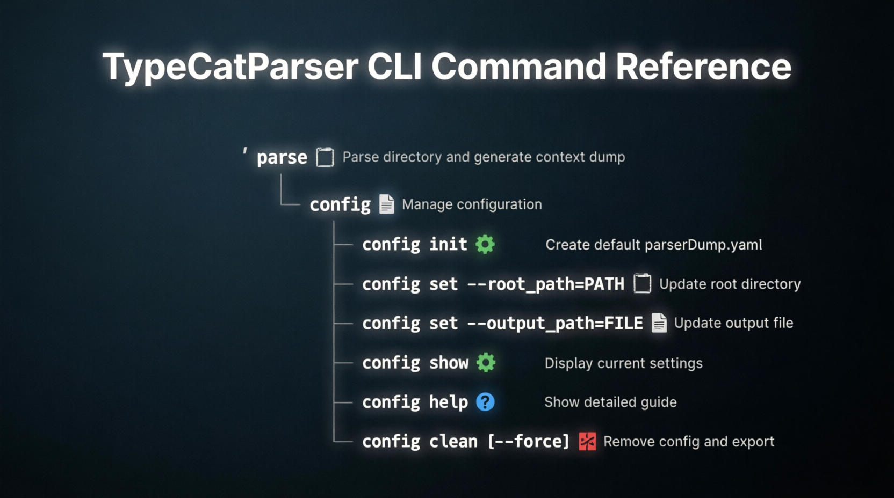

# VERSION 0.1 ScrapperProject

# Quick Start

### 1. Initialize config
.\ParseDirContext.exe config init

### 2. View current settings
.\ParseDirContext.exe config show

### 3. Change root directory
.\ParseDirContext.exe config set --root_path=./src

### 4. Change output file
.\ParseDirContext.exe config set --output_path=./dump/context.md

### 5. Run parser
.\ParseDirContext.exe parse

### 6. Clean up (with confirmation)
.\ParseDirContext.exe config clean

### 7. Clean up (no questions)
.\ParseDirContext.exe config clean --force